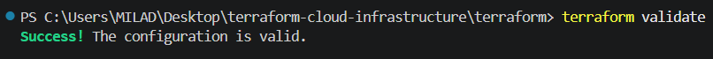
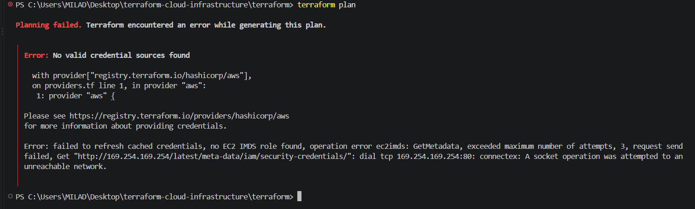

# Terraform Cloud Infrastructure

A portfolio-focused Infrastructure as Code project built with Terraform and AWS.

This project demonstrates how cloud infrastructure can be defined, structured, validated, secured, and version-controlled using Terraform.

> Note: The current project has been locally initialized and validated with Terraform. Real AWS provisioning has not yet been performed because valid AWS account credentials are not currently available.

---

## Project Goals

The main goals of this project are to demonstrate practical skills in:

- Terraform
- Infrastructure as Code
- AWS cloud infrastructure design
- VPC networking
- Public subnets
- Security Groups
- EC2 compute
- Application Load Balancer
- Terraform variables and outputs
- Infrastructure validation
- Git and GitHub workflow
- GitHub Actions CI validation

---

## Architecture

```text
Internet
   |
   | HTTP : 80
   v
Application Load Balancer
   |
   | ALB Security Group
   v
Target Group
   |
   | HTTP : 80
   v
EC2 Security Group
   |
   v
EC2 Instance
   |
   v
Nginx
```

Network architecture:

```text
                    Internet
                       |
                       v
               Internet Gateway
                       |
                       v
               Public Route Table
                  /           \
                 /             \
                v               v
        Public Subnet 1   Public Subnet 2
            AZ #1            AZ #2
                 \           /
                  \         /
                   v       v
          Application Load Balancer
                     |
                     v
                Target Group
                     |
                     v
                  EC2
                     |
                     v
                   Nginx
```

---

## Infrastructure Components

The Terraform configuration currently includes:

- AWS VPC
- Two Public Subnets
- Two Availability Zones
- Internet Gateway
- Public Route Table
- Route Table Associations
- Application Load Balancer Security Group
- EC2 Security Group
- Amazon Linux 2023 AMI lookup
- EC2 Instance
- Nginx installation using user data
- Application Load Balancer
- Target Group
- Target Group Attachment
- HTTP Listener
- Terraform Variables
- Terraform Outputs
- GitHub Actions Terraform validation workflow

---

## Project Structure

```text
terraform-cloud-infrastructure/
├── .github/
│   └── workflows/
│       └── terraform.yml
├── terraform/
│   ├── main.tf
│   ├── variables.tf
│   ├── outputs.tf
│   ├── providers.tf
│   ├── versions.tf
│   └── .terraform.lock.hcl
├── docs/
│   └── architecture.md
├── screenshots/
│   ├── terraform-plan-no-credentials.png
│   └── terraform-validate-success.png
├── .gitignore
└── README.md
```

---

## AWS Region

Default region:

```text
eu-central-1
```

The Frankfurt AWS region is used as the default region.

---

## Networking

VPC CIDR:

```text
10.0.0.0/16
```

Public subnets:

```text
10.0.1.0/24
10.0.2.0/24
```

The two public subnets are configured in separate Availability Zones.

An Internet Gateway and public route table provide internet routing for the public subnets.

---

## Security Architecture

The project uses separate Security Groups for the Application Load Balancer and EC2 instance.

### Application Load Balancer Security Group

The ALB Security Group allows public HTTP traffic:

```text
TCP 80
Source: 0.0.0.0/0
```

### EC2 Security Group

The EC2 Security Group allows HTTP traffic only from the Application Load Balancer Security Group:

```text
TCP 80
Source: ALB Security Group
```

The EC2 instance does not currently expose SSH access.

This removes the previous public SSH rule and prevents direct public HTTP access to the EC2 instance through the Security Group.

Traffic flow:

```text
Internet
   |
   v
ALB Security Group
   |
   v
Application Load Balancer
   |
   v
EC2 Security Group
   |
   v
EC2 Instance
```

Terraform state files, variable files, private keys, environment files, and other sensitive files are excluded through `.gitignore`.

No AWS credentials or secrets are stored in this repository.

---

## Compute

The project defines an EC2 instance using Amazon Linux 2023.

Instance type:

```text
t3.micro
```

Terraform user data automatically:

1. Installs Nginx
2. Enables the Nginx service
3. Starts Nginx
4. Creates a simple HTML test page

---

## Load Balancing

The architecture includes an AWS Application Load Balancer.

Traffic flow:

```text
Internet
   |
   v
Application Load Balancer
   |
   v
HTTP Listener
   |
   v
Target Group
   |
   v
EC2 Instance
```

The listener accepts HTTP traffic on port 80.

The load balancer is configured to use both public subnets across separate Availability Zones.

---

## Terraform Variables

Current variables:

- AWS region
- Project name
- Environment

Default values:

```hcl
aws_region   = "eu-central-1"
project_name = "terraform-cloud-infrastructure"
environment  = "dev"
```

---

## Terraform Outputs

The project currently defines outputs for:

- VPC ID
- Public Subnet 1 ID
- Public Subnet 2 ID
- Security Group ID
- EC2 Instance ID
- EC2 Public IP
- Load Balancer DNS name
- Target Group ARN

---

## Local Terraform Validation

The following Terraform commands have been successfully completed:

```bash
terraform init
terraform fmt
terraform validate
```

Validation result:

```text
Success! The configuration is valid.
```

A real `terraform plan` was also attempted.

Terraform successfully detected the AWS configuration, but the planning process stopped because valid AWS credentials are not currently available.

Observed error:

```text
Error: No valid credential sources found
```

This represents the current boundary of what can be verified locally without an authenticated AWS account.

---

## GitHub Actions CI

The repository includes an automated Terraform validation workflow using GitHub Actions.

The workflow runs automatically on:

- Pushes to `main`
- Pull requests targeting `main`

The CI workflow performs:

```bash
terraform fmt -check
terraform init -backend=false
terraform validate
```

The GitHub Actions workflow has been successfully executed and passed.

Workflow:

```text
.github/workflows/terraform.yml
```

This provides automated validation of the Terraform configuration on GitHub in addition to local validation.

---

## Validation Evidence

### Terraform Validate

The Terraform configuration passed local validation successfully:



### Terraform Plan

A real Terraform plan was attempted against the AWS provider.

The process stopped at AWS authentication because no valid AWS credentials are currently available:



The current limitation is AWS authentication, not Terraform syntax validation.

---

## Deployment Status

```text
Terraform configuration: COMPLETE
Terraform initialization: COMPLETE
Terraform formatting: COMPLETE
Terraform validation: COMPLETE
Security Group hardening: COMPLETE
GitHub Actions CI validation: COMPLETE
Terraform plan attempt: COMPLETED UNTIL AWS AUTHENTICATION

AWS authentication: NOT AVAILABLE
AWS real deployment: NOT YET PERFORMED
terraform apply: NOT YET PERFORMED
Cloud resource validation: NOT YET PERFORMED
terraform destroy validation: NOT YET PERFORMED
```

The project does not claim that the infrastructure has been deployed to a real AWS environment.

Real AWS deployment will only be documented after successful provisioning and verification.

---

## Cost Awareness

Some AWS resources used by this project may generate charges when deployed.

Before real deployment:

- Review AWS pricing
- Configure billing alerts
- Avoid leaving unnecessary resources running
- Validate resources after deployment
- Run `terraform destroy` after testing when appropriate

---

## Terraform Workflow

Current validated local workflow:

```bash
terraform init
terraform fmt
terraform validate
```

Current CI workflow:

```bash
terraform fmt -check
terraform init -backend=false
terraform validate
```

Planned authenticated AWS workflow:

```bash
terraform plan
terraform apply
```

Cleanup:

```bash
terraform destroy
```

At the current stage, the non-billable local and CI validation workflows have been completed.

`terraform plan` was attempted but could not proceed beyond AWS authentication because valid credentials are not currently available.

---

## Architecture Documentation

Additional infrastructure architecture documentation is available here:

```text
docs/architecture.md
```

It includes:

- Network design
- VPC structure
- Subnet architecture
- Security configuration
- EC2 design
- Application Load Balancer traffic flow
- Current validation state
- Future architecture improvements

---

## Future Improvements

Possible future improvements include:

- Real AWS deployment
- Cloud-side validation
- HTTPS listener
- AWS Certificate Manager integration
- Private subnets
- Auto Scaling Group
- Remote Terraform state
- Terraform modules
- Application Load Balancer health validation
- EC2 connectivity validation
- Deployment evidence
- Terraform destroy and cleanup validation

These improvements will only be documented as completed after they are actually implemented and verified.

---

## Portfolio Status

This project is part of a DevOps portfolio focused on practical and verifiable skills.

The Terraform configuration, security architecture, documentation, Git history, validation evidence, and GitHub Actions workflow reflect the actual implementation state of the project.

No live AWS infrastructure is claimed until real provisioning and validation are completed.